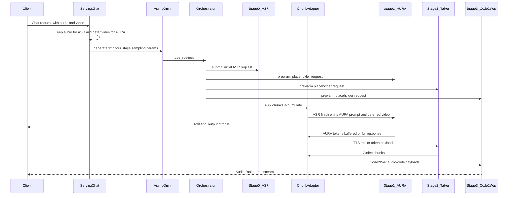
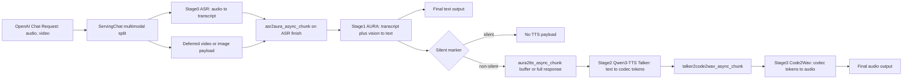

# AURA Omni Pipeline

`aura_omni` wires ASR, AURA, and Qwen3-TTS into one vLLM-Omni pipeline:

```text
ASR -> AURA -> Qwen3-TTS Talker -> Code2Wav
```

Qwen3-TTS remains two engine stages so the pipeline reuses the existing native
Talker and Code2Wav implementation.

```bash
vllm serve aurateam/AURA \
  --omni \
  --deploy-config vllm_omni/deploy/aura_omni.yaml \
  --served-model-name aurateam/AURA \
  --trust-remote-code
```

Configure local checkpoints by editing per-stage `model` values in
`vllm_omni/deploy/aura_omni.yaml`. The deploy file sets
`pipeline: aura_omni`, so the four-stage topology is used even if the
command-line `--model` points at one of the component checkpoints.

Send requests with `"model": "aurateam/AURA"`. The ASR, AURA, and Qwen3-TTS
checkpoint paths are internal stage models from the deploy YAML, not the
OpenAI-facing served model name.

The AURA stage can emit `<|silent|>`. Silent outputs are treated as a gate:
they produce no Qwen3-TTS Talker input, so no audio is synthesized for that
turn.

## Async Chunk Flow

`vllm_omni/deploy/aura_omni.yaml` enables `async_chunk` by default. In this
mode, the orchestrator admits the ASR request and prewarms downstream stages
with placeholder prompts. The scheduler-owned `OmniChunkTransferAdapter` then
drives inter-stage payloads through the connector.





## GPU Utilization Recommendation

`gpu_memory_utilization` in `vllm_omni/deploy/aura_omni.yaml` controls how much
VRAM each stage can reserve. Start with this split for a single GPU:

- Stage 0 (ASR): `0.10`
- Stage 1 (AURA): `0.40`
- Stage 2 (Qwen3-TTS Talker): `0.20`
- Stage 3 (Qwen3-TTS Code2Wav): `0.20`

## TTS Modes

`aura_omni` can pass AURA text to Qwen3-TTS in two task modes:

- `Base`: voice clone from `tts_ref_audio` with ICL enabled in the AURA
  pipeline. Provide both `tts_ref_audio` and `tts_ref_text`. Set
  `tts_x_vector_only_mode=true` to disable ICL and use speaker embedding only.
- `CustomVoice`: predefined speaker mode. Use a Qwen3-TTS CustomVoice
  checkpoint for stages 2 and 3 in `aura_omni.yaml`, then pass
  `tts_task_type=CustomVoice` and `tts_speaker`.

The checked-in deploy profile currently points stages 2 and 3 at CustomVoice
checkpoint paths. Switch both TTS stage models to Base checkpoints before using
Base voice-clone mode.

By default, AURA responses are passed to Qwen3-TTS as text. Set
`additional_information.tts_pass_token_ids=true` to pass AURA-generated
assistant token ids directly instead. Even when token passthrough is disabled,
the stage processor uses AURA token ids when available to estimate the Talker
prefill length, so scheduling does not rely on raw character length.

The example client exposes this as:

```bash
python examples/online_serving/aura_omni/openai_chat_completion_client.py \
  --tts-pass-token-ids
```
