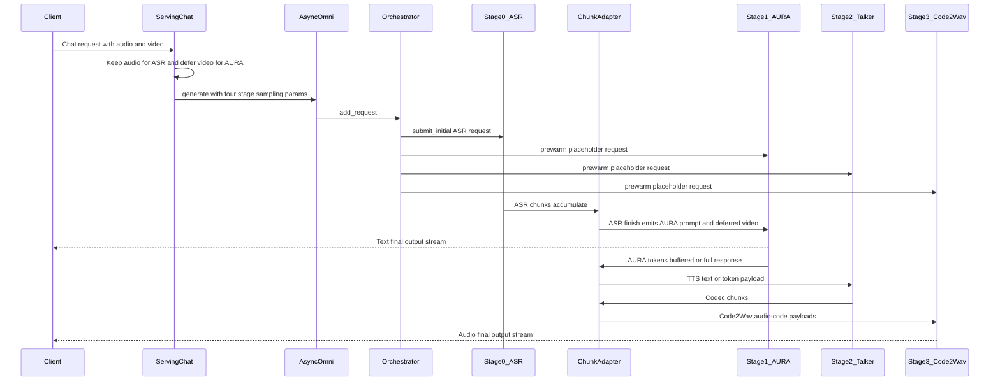
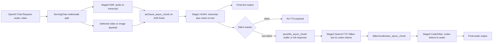

# AURA Omni Pipeline

`aura_omni` serves AURA as a native multi-stage vLLM-Omni pipeline:

```text
Qwen3-ASR -> AURA/Qwen3-VL -> Qwen3-TTS Talker -> Qwen3-TTS Code2Wav
```

The pipeline has three semantic modules, but four engine stages because the
existing Qwen3-TTS implementation is natively split into Talker and Code2Wav.

Start the server with the deploy profile:

```bash
vllm serve aurateam/AURA \
  --omni \
  --port 8091 \
  --deploy-config vllm_omni/deploy/aura_omni.yaml \
  --served-model-name aurateam/AURA \
  --trust-remote-code
```

The deploy file sets per-stage model repos:

- Stage 0 ASR: `Qwen/Qwen3-ASR-1.7B`
- Stage 1 AURA: `aurateam/AURA`
- Stage 2/3 TTS: `Qwen/Qwen3-TTS-12Hz-1.7B-Base`

For local weights, edit the `model` value on each stage in
`vllm_omni/deploy/aura_omni.yaml`. The deploy profile includes
`pipeline: aura_omni`, so the server uses this four-stage topology even when
the command-line model path points at one component checkpoint.

Expected request shape:

- Send microphone audio as the Stage 0 multimodal audio input.
- Include video frames in the original request `multi_modal_data`; the
  `asr2aura` processor carries them forward to AURA.
- Optional `additional_information` keys:
  - `aura_system_prompt`
  - `tts_task_type`
  - `tts_language`
  - `tts_speaker`
  - `tts_instruct`
  - `tts_ref_audio`
  - `tts_ref_text`
  - `tts_x_vector_only_mode`
  - `tts_pass_token_ids`
  - `aura_tts_full_response`

If AURA emits `<|silent|>`, the `aura2tts` processor returns no TTS request, so
the TTS stages are skipped for that turn.

## Async Chunk Flow

`vllm_omni/deploy/aura_omni.yaml` enables `async_chunk` by default. In this
mode, the orchestrator admits the ASR request and prewarms downstream stages
with placeholder prompts. The scheduler-owned `OmniChunkTransferAdapter` then
drives inter-stage payloads through the shared-memory connector.



The same topology can run with `--no-async-chunk`, but that path waits for each
stage to finish before the orchestrator calls the next stage's sync processor.
Async chunk moves those handoffs into connector payload processors:



## GPU Utilization Recommendation

Tune `gpu_memory_utilization` per stage in `vllm_omni/deploy/aura_omni.yaml`.
Recommended baseline on one GPU for H200

- Stage 0 (ASR): `0.10`
- Stage 1 (AURA): `0.4`
- Stage 2 (Qwen3-TTS Talker): `0.20`
- Stage 3 (Qwen3-TTS Code2Wav): `0.20`

## Python Client

```bash
python examples/online_serving/aura_omni/openai_chat_completion_client.py \
  --host localhost \
  --port 8091 \
  --model aurateam/AURA \
  --modalities text,audio
```

Use local media:

```bash
python examples/online_serving/aura_omni/openai_chat_completion_client.py \
  --audio-path /path/to/input.wav \
  --video-path /path/to/video.mp4 \
  --output-dir output_aura_omni_online
```

Base voice clone mode (default, recommended as x-vector while debugging ICL):

```bash
python examples/online_serving/aura_omni/openai_chat_completion_client.py \
  --tts-task-type Base \
  --tts-ref-audio vllm-omni/tests/assets/qwen3_tts/clone_2.wav \
  --tts-ref-text "Okay. Yeah. I resent you. I love you. I respect you. But you know what? You blew it! And thanks to you."
```

Enable AURA token-id passthrough explicitly:

```bash
python examples/online_serving/aura_omni/openai_chat_completion_client.py \
  --tts-pass-token-ids
```

Wait until AURA finishes the current answer before sending one complete text
payload to TTS:

```bash
python examples/online_serving/aura_omni/openai_chat_completion_client.py \
  --aura-tts-full-response
```

CustomVoice mode requires stages 2 and 3 in `aura_omni.yaml` to point at a
Qwen3-TTS CustomVoice checkpoint:

```bash
python examples/online_serving/aura_omni/openai_chat_completion_client.py \
  --tts-task-type CustomVoice \
  --tts-speaker Vivian
```

By default, AURA responses are passed to Qwen3-TTS as text. Set
`tts_pass_token_ids=true` to pass AURA-generated assistant token ids directly
to Qwen3-TTS instead. The processor still uses AURA token ids, when available,
to estimate the Talker prompt length in the default text path.

Set `aura_tts_full_response=true` to buffer AURA output until the current answer
is finished, then send a single full-text TTS request. This is useful for
CustomVoice and other non-streaming TTS modes that expect complete text
conditioning in the Talker prefill.

## Curl

```bash
cd examples/online_serving/aura_omni
bash run_curl_multimodal_generation.sh
```

Set `PORT`, `MODEL`, or `OUTPUT_DIR` to override defaults:

```bash
PORT=8666 MODEL=aurateam/AURA bash run_curl_multimodal_generation.sh
TTS_PASS_TOKEN_IDS=true PORT=8666 MODEL=aurateam/AURA bash run_curl_multimodal_generation.sh
AURA_TTS_FULL_RESPONSE=true PORT=8666 MODEL=aurateam/AURA bash run_curl_multimodal_generation.sh
```

## Gradio

Launch the server and Gradio UI together:

```bash
cd examples/online_serving/aura_omni
bash run_gradio_demo.sh
```

If the server is already running:

```bash
python examples/online_serving/aura_omni/gradio_demo.py \
  --model aurateam/AURA \
  --api-base http://localhost:8091/v1
```

## Offline

For offline inference, see
[`examples/offline_inference/aura_omni`](../../offline_inference/aura_omni/).
